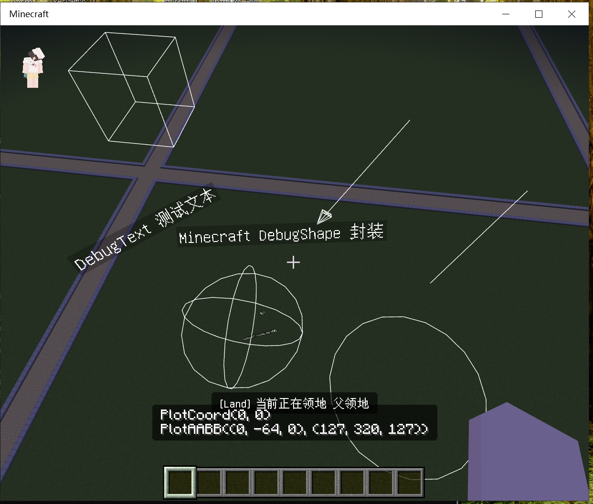

# DebugShape

minecraft bedrock debug shape packet wrapper



## Usage

- xmake.lua

```lua
add_repositories("engsr6982-repo https://github.com/engsr6982/xmake-repo.git")

add_requires("debug_shape 0.1.0")
```

```cpp
#include "debug_shape/DebugShape.h"

void enable() {
    auto shape = std::make_unique<debug_shape::DebugShape>();
    shape->draw();
    shape->remove();
}
```

## Quick experience

1. Clone the source code

```bash
git clone https://github.com/engsr6982/DebugShape.git
```

2. Compile the project and start the test code.

```bash
cd DebugShape
xmake f --test=y
```

3. Install levilamina and mod

4. Use the **/shape** command for a quick experience.

> Since this is test code, only basic demonstrations are provided. For more attributes (color, scaling, etc.), please use the API.

```log
? shape
21:41:44.798 INFO [Server] shape:
21:41:44.798 INFO [Server] Minecraft DebugShape
21:41:44.798 INFO [Server] Usage:
21:41:44.798 INFO [Server] - /shape arrow <start: x y z> <end: x y z>
21:41:44.798 INFO [Server] - /shape box <start: x y z> <end: x y z>
21:41:44.798 INFO [Server] - /shape circle <position: x y z> [scale: float]
21:41:44.798 INFO [Server] - /shape clear
21:41:44.798 INFO [Server] - /shape extension bounds_box <start: x y z> <end: x y z>
21:41:44.798 INFO [Server] - /shape line <start: x y z> <end: x y z>
21:41:44.798 INFO [Server] - /shape sphere <position: x y z> [scale: float]
21:41:44.798 INFO [Server] - /shape text <position: x y z> <text: string>
```

## LICENSE

LGPL v3 or later
